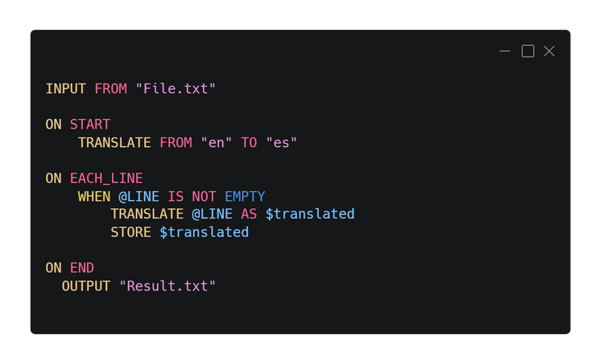

<div align="center">

# Scriptal   
**A Language for Easy Text Processing and Learning Programming**


English | [Español](./README_ES.md)
</div>


Scriptal is a programming language designed for text processing, created with Python. It was developed to facilitate the learning of programming languages, based on the structure of English. Its goal is to provide an efficient and clear way to work with text through an easy-to-understand and use syntax. Scriptal enables accessible and rapid learning, making text processing a simple and manageable task. 

<br>

<div align="center">


<br>


</div>

<br>

Scriptal is a dynamic and accessible language that transforms text processing into a simple experience, with intuitive commands and a syntax aligned with English logic. Designed to enhance efficiency, Scriptal caters to both beginners and advanced developers.


<br>

<div align="center">

</div>


## Quick Installation

For an easy installation on Windows, download the installer from the [**Releases**](../../releases/latest) section of the GitHub repository. Follow the installer instructions to complete the setup.

## Manual Installation

If you prefer to install Scriptal manually, follow these steps:

1. **Clone the Repository or Download the Portable Version:**

   If you want the latest version of the code, clone the repository using Git. If you prefer a portable version, download it from the [**Releases**](../../releases/latest) section.

   ```bash
   git clone https://github.com/martin-amaro/Scriptal.git
   ```

2. **Set Up Environment Variables on Windows**

   To run Scriptal from anywhere in the command line, follow these steps:

   - Copy the path of the directory containing `scriptal.exe`.
   - Open the Start menu and search for "Environment Variables".
   - Select "Edit the system environment variables".
   - In the window that appears, find and select the `Path` variable, then click "Edit".
   - Click "New" and paste the copied path. Then, click "OK".

## Usage

To use Scriptal, follow these steps:

1. **Run Files:**

   You can run Scriptal files (_*.stal_) from the command line:

   ```bash
   scriptal file1.stal file2.stal
   ```

2. **Interactive Mode:**

   Scriptal offers an interactive mode where you can write and execute Scriptal code directly from the command line.

   To start the interactive mode, run Scriptal with no arguments:

   ```bash
   scriptal
   ```

   <br>

   Type your commands and press `Enter` after each line. To execute the code, press `Enter` twice (once to create a new line and once more to execute). Use `EXIT` to leave interactive mode.

   ```bash
   Scriptal 1.0
   Type your input below. Use 'EXIT' to quit.
   >>> PRINT 32
   ```

   


## Examples

To see examples of Scriptal usage, visit the examples folder in the repository:

- [Scriptal Examples](./examples/)

## Documentation

The complete Scriptal documentation is available at the following links:

- [Documentation in English](./docs/Guide_EN.md)
- [Full Command List](./docs/Commands_EN.md)

## Visual Studio Code Extension

You can download the Scriptal extension for Visual Studio Code from the VS Code marketplace:

- [Scriptal Extension for VS Code](https://marketplace.visualstudio.com/items?itemName=MartinAmaro.scriptal)

## Contributions

Currently, Scriptal is not an open-source project, but we plan to make it open source in the future. However, we value your feedback and suggestions.

If you find bugs, have ideas for new features, or wish to contribute in any way, feel free to get in touch. You can submit your suggestions or report issues via the Issues section in the repository or by directly contacting the team.

## Contact

If you have questions, suggestions, or need assistance with Scriptal, you can contact us through the following means:

- **Email:** amarodev05@gmail.com
- **GitHub Issues:** You can report problems or make suggestions directly in the [Issues section](../../issues) of the repository.

We will respond to your inquiries as soon as possible and appreciate your interest in improving Scriptal.
