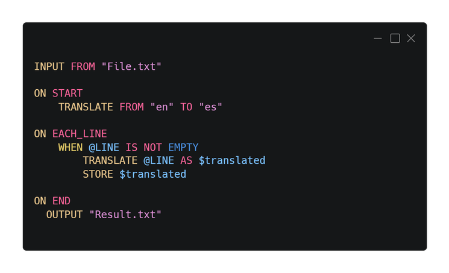

<div align="center">

# Scriptal   
**Un lenguaje para el procesamiento de texto fácil y el aprendizaje de programación**


[English](./README.md) | Español
</div>


Scriptal es un lenguaje de programación diseñado para el procesamiento de texto, creado con Python. Fue creado para facilitar el aprendizaje de lenguajes de programación, basándose en la estructura del inglés. Su objetivo es proporcionar una manera eficiente y clara de trabajar con texto mediante una sintaxis fácil de entender y utilizar. Scriptal permite un aprendizaje accesible y rápido, haciendo que el procesamiento de texto sea una tarea sencilla y manejable.

<div align="center">


<br>


</div>

<br>

Scriptal es un lenguaje dinámico y accesible que transforma el procesamiento de texto en una experiencia sencilla, con comandos intuitivos y una sintaxis alineada con la lógica del inglés. Diseñado para mejorar la eficiencia, Scriptal se adapta tanto a principiantes como a desarrolladores avanzados.


<br>

<div align="center">

</div>


## Instalación Rápida

Para una instalación sencilla en Windows, descarga el instalador desde la sección [**Releases**](../../releases/latest) del repositorio de GitHub. Sigue las instrucciones del instalador para completar la configuración.


## Instalación Manual

Si prefieres instalar Scriptal manualmente, sigue estos pasos:

1. **Clona el Repositorio o Descarga la versión Portable:**

   Si deseas la versión más reciente del código, clona el repositorio usando Git. Si prefieres una versión portable, descárgala desde la sección [**Releases**](../../releases/latest).

   ```bash
   git clone https://github.com/martin-amaro/Scriptal.git
   ```

2. **Configura las Variables de Entorno en Windows**

   Para poder ejecutar scriptal desde cualquier lugar en la línea de comandos, sigue estos pasos:

   - Copia la ruta del directorio que contiene `scriptal.exe`.
   - Abre el menú Inicio y busca "Variables de entorno".
   - Selecciona Editar las variables de entorno del sistema.
   - En la ventana que aparece, busca y selecciona la variable `Path`, luego haz clic en Editar.
   - Haz clic en Nuevo y pega la ruta copiada. Luego, haz clic en Aceptar.

## Uso

Para usar Scriptal, sigue estos pasos:

1. **Ejecutar Archivos:**

   Puedes ejecutar archivos Scriptal (_*.stal_) desde la línea de comandos:

   ```bash
   scriptal file1.stal file2.stal
   ```

2. **Modo Interactivo:**

   Scriptal ofrece un modo interactivo donde puedes escribir y ejecutar código Scriptal directamente desde la línea de comandos.

   Para iniciar el modo interactivo, ejecuta Scriptal sin argumentos:

   ```bash
   scriptal
   ```

   <br>

   Escribe tus comandos y presiona `Enter` después de cada línea. Para ejecutar el código, presiona `Enter` dos veces (una para crear una nueva línea y otra para ejecutar). Usa `EXIT` para salir del modo interactivo.

   ```bash
   Scriptal 1.0
   Type your input below. Use 'EXIT' to quit.
   >>> PRINT 32
   ```

   


## Ejemplos

Para ver ejemplos de uso de Scriptal, visita la carpeta de ejemplos en el repositorio:

- [Ejemplos de Scriptal](./examples/)

## Documentación

La documentación completa de Scriptal está disponible en los siguientes enlaces:

- [Documentación en Español](./docs/Guide_ES.md)
- [Lista completa de Comandos](./docs/Commands_ES.md)


## Extensiones de Visual Studio Code

Puedes descargar las extensiones de Visual Studio Code para Scriptal desde el marketplace de VS Code:

- [Extensión Scriptal para VS Code](https://marketplace.visualstudio.com/items?itemName=MartinAmaro.scriptal)
- [Extensión Scriptal Runner para VS Code](https://marketplace.visualstudio.com/items?itemName=MartinAmaro.scriptal-runner)


## Contribuciones

Actualmente, Scriptal no es un proyecto de código abierto, pero planeamos hacerlo open source en el futuro. A pesar de esto, valoramos tus comentarios y sugerencias.

Si encuentras errores, tienes ideas para nuevas funciones, o deseas contribuir de alguna manera, no dudes en ponerte en contacto. Puedes enviar tus sugerencias o reportes de errores a través de la sección de Issues en el repositorio o mediante el contacto directo con el equipo.

## Contacto

Si tienes preguntas, sugerencias, o necesitas asistencia con Scriptal, puedes ponerte en contacto con nosotros a través de los siguientes medios:

- **Correo Electrónico:** amarodev05@gmail.com
- **Issues en GitHub:** Puedes reportar problemas o hacer sugerencias directamente en la [sección de Issues](../../issues) del repositorio.

Responderemos a tus consultas lo antes posible y apreciamos tu interés en mejorar Scriptal.